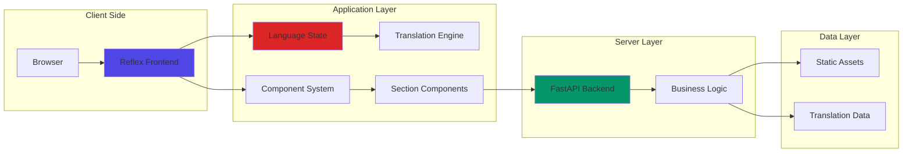

# 🚀 Michał Sztymelski's Portfolio

A modern, multilingual portfolio website built with **Reflex** (Python-based web framework), showcasing my journey as a software developer and AI enthusiast. Features responsive design, smooth animations, and bilingual support (Polish/English).

## 🌟 Live Demo

🔗 **[View Live Portfolio](https://michal-sztymelski-portfolio.up.railway.app)**

## 📋 Table of Contents

- [Features](#-features)
- [Architecture](#-architecture)
- [Installation](#-installation)
- [Usage](#-usage)
- [Docker Deployment](#-docker-deployment)
- [Project Structure](#-project-structure)
- [License](#-license)

## ✨ Features

- 🌍 **Bilingual Support** - Polish and English with dynamic language switching
- 📱 **Responsive Design** - Optimized for mobile, tablet, and desktop
- 🎨 **Modern UI/UX** - Glassmorphism effects with smooth animations
- 🚀 **Fast Performance** - Built with Reflex for optimal speed
- 🐳 **Docker Ready** - Microservices architecture with separate frontend/backend containers
- 🔄 **Real-time Updates** - Dynamic content rendering
- 🎯 **SEO Optimized** - Built-in sitemap generation

### Core Technologies

| Category | Technology | Version | Purpose |
|----------|------------|---------|---------|
| **Framework** | Reflex | 0.8.1 | Full-stack Python web framework |
| **Backend** | FastAPI | 0.116.1 | API and server logic |
| **Styling** | TailwindCSS | v4 | Modern, responsive styling |
| **Database** | SQLAlchemy | 2.0.41 | Data management |
| **Deployment** | Docker | Latest | Containerization |
| **Cloud** | Railway | - | Production hosting |

## 🏗 Architecture



## 🚀 Installation

### Prerequisites

- Python 3.12+
- Node.js (for Reflex compilation)
- Docker (optional, for containerized deployment)

### Local Development

1. **Clone the repository**
   ```bash
   git clone https://github.com/Stimm147/portfolio.git
   cd portfolio
   ```

2. **Create virtual environment**
   ```bash
   python -m venv venv
   source venv/bin/activate  # On Windows: venv\Scripts\activate
   ```

3. **Install dependencies**
   ```bash
   pip install -r requirements.txt
   ```

4. **Initialize Reflex**
   ```bash
   reflex init
   ```

5. **Run development server**
   ```bash
   reflex run
   ```

The application will be available at:
- Frontend: `http://localhost:3000`
- Backend: `http://localhost:8000`

## 🎯 Usage

### Language Switching
The portfolio supports real-time language switching between Polish and English:

```python
# Language state management
class LanguageState(rx.State):
    language: str = "pl"  # Default to Polish
    
    def set_language(self, lang: str):
        self.language = lang
```

### Adding New Translations
1. Edit `translations.py`
2. Add new keys to both `"pl"` and `"en"` dictionaries
3. Reference in components using `LanguageState.your_key`

### Customizing Content
- **Personal Info**: Edit translation strings in `translations.py`
- **Projects**: Modify project descriptions and add new projects in translation file
- **Styling**: Update component styles in section files
- **Images**: Replace image URLs in component files

## 🐳 Docker Deployment

The application uses a microservices architecture with separate containers:

### Frontend Container
```dockerfile
# Dockerfile.frontend
FROM python:3.12-slim-bookworm
# ... (optimized for frontend serving)
CMD reflex run --env prod --frontend-only --frontend-port ${PORT}
```

### Backend Container
```dockerfile
# Dockerfile.backend  
FROM python:3.12-slim-bookworm
# ... (optimized for API serving)
CMD reflex run --env prod --backend-only --backend-port ${PORT}
```

### Quick Docker Setup
```bash
# Build images
docker build -f Dockerfile.frontend -t portfolio-frontend .
docker build -f Dockerfile.backend -t portfolio-backend .

# Run containers
docker run -p 3000:3000 portfolio-frontend
docker run -p 8000:8000 portfolio-backend
```

## 🌐 Featured Sections

### 🎯 Image Section
- Animated profile image with slide-in effects
- Dynamic title with multilingual support
- Responsive background with Unsplash imagery

### 👨‍💻 About Me
- Personal introduction with technology focus
- Educational timeline (Technical School → University)
- Science club involvement and achievements
- Technology tags with color-coded categories

### 💼 Projects Showcase
- **Neptun's Eye**: ML-based point cloud segmentation tool
- **Portfolio Website**: This very project you're viewing
- Interactive project cards with technology stacks
- External GitHub integration

### 🔄 Language System
- Real-time Polish ↔ English switching
- Persistent language state
- Comprehensive translation coverage

## 🚀 Deployment

### Railway Cloud (Production)
The application is deployed on Railway with the following configuration:
- **Frontend URL**: `https://michal-sztymelski-portfolio.up.railway.app`
- **CORS Configuration**: Supports both localhost and production domains
- **Environment**: Production-optimized with separate frontend/backend services

### Environment Variables
```bash
API_URL=http://127.0.0.1:8000  # Local development
# API_URL=https://your-backend-url.com  # Production
```

## 📈 Performance Features

- ⚡ **Fast Loading**: Optimized Reflex components
- 🎭 **Smooth Animations**: CSS3 transitions and transforms
- 📱 **Mobile First**: Progressive enhancement for larger screens
- 🔄 **State Management**: Efficient reactive state updates
- 🌐 **SEO Ready**: Built-in sitemap generation

## 🎨 Design Philosophy

- **Glassmorphism**: Modern translucent design elements
- **Dark Theme**: Professional aesthetic with high contrast
- **Accessibility**: WCAG-compliant color schemes and responsive typography
- **Micro-interactions**: Subtle hover effects and transitions

## 📝 License

This project is open source and available under the [MIT License](LICENSE).

---

<p align="center">
  <i>Built with ❤️ using Reflex and Python</i>
</p>
